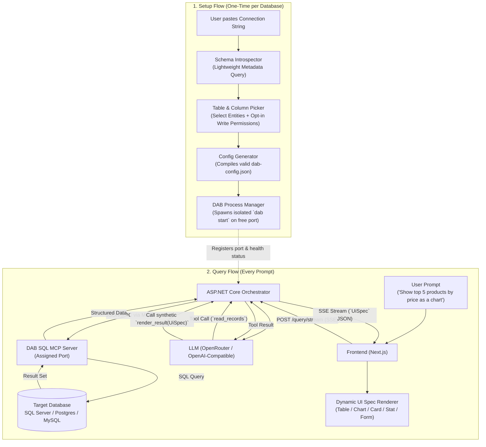

<div align="center">

# ⚡ Zeroquery

### Point at any database → Auto-generate a scoped MCP server → Query in natural language with a dynamic UI.

[](https://dotnet.microsoft.com/download/dotnet/10.0)
[](https://nextjs.org/)
[](https://github.com/Azure/data-api-builder)
[](https://modelcontextprotocol.io/)
[](#-testing)
[](#-docker-quickstart)
[](LICENSE)

<p align="center">
  <a href="#-key-features">Key Features</a> •
  <a href="#-architecture">Architecture</a> •
  <a href="#-dynamic-ui-specs">Dynamic UI</a> •
  <a href="#-docker-quickstart">Docker Quickstart</a> •
  <a href="#-local-development">Local Setup</a> •
  <a href="#-recommended-llm-models">Recommended Models</a> •
  <a href="#-security-architecture">Security</a> •
  <a href="#-contributing">Contributing</a>
</p>

</div>

---

> [!NOTE]
> **Experimental OSS Pattern:** Zeroquery explores the *"connect any database → get an isolated, tool-calling AI application"* pattern. It combines Microsoft Data API Builder (DAB) as an isolated SQL MCP subprocess with ASP.NET Core orchestration and Next.js dynamic rendering. See [`doc/Plan.md`](doc/Plan.md) for architectural notes and known trade-offs.

---

## 💡 What is Zeroquery?

Connecting AI models to relational databases typically involves either risky direct SQL generation (susceptible to SQL injection and hallucinations) or building bespoke APIs by hand.

**Zeroquery automates this entire lifecycle in seconds:**
1. **Introspects** your database schema (SQL Server, LocalDB, PostgreSQL, MySQL) without reading raw data.
2. Lets you **pick tables, columns, and write operations**, auto-generating natural-language entity descriptions.
3. Compiles a schema-validated `dab-config.json` and spins up an isolated **Microsoft Data API Builder (DAB)** SQL MCP server on an allocated port.
4. Orchestrates an **LLM tool-calling loop** over the Model Context Protocol (MCP) and streams live reasoning via Server-Sent Events (SSE).
5. Renders query results into a **dynamically typed UI** (Interactive Tables, Recharts Bar/Line/Pie Graphs, Entity Inspection Cards, Metric Stats, and Human-Confirmed Mutation Forms).

---

## ✨ Key Features

- **⚡ Zero-Code MCP Provisioning**: Turns any raw connection string into a running, isolated Model Context Protocol (MCP) server in seconds—no manual JSON authoring or CLI commands required.
- **💬 Natural Language to Dynamic UI**: Translates conversational questions into real database queries via DAB's `read_records` and `describe_entities` tools, streaming progress live to the browser.
- **📊 Adaptive UI Spec Components**:
  - **Tables**: Sortable, typed data grid with source entity attribution.
  - **Charts**: Interactive **Recharts** visualizations (Bar, Line, and Pie) styled with curated theme design tokens.
  - **Cards**: Two-column key/value inspector grids for individual record details.
  - **Stats**: High-impact numeric metric badges for counts, sums, and KPI aggregates.
  - **Forms**: Visual field-level diff preview with editable proposals for database writes.
- **🛡️ Human-in-the-Loop Write Access (Full CRUD)**: Per-entity, per-operation write permissions (`Create`, `Update`, `Delete`). Direct mutation tools are excluded from the LLM's autonomous pool; all writes require explicit human confirmation.
- **🔐 Hardened Security Out-of-the-Box**:
  - **Data Protection API**: Connection strings and OpenRouter API keys are encrypted at rest with AES-256 (`zqenc:v1:`).
  - **SSRF Defense**: Configurable validator blocking loopback, RFC1918 private subnets, and cloud metadata targets (`169.254.169.254`).
  - **OS Resource Limits**: Child processes are bound to Win32 Job Objects with memory caps, CPU quotas, and OS-level `KILL_ON_CLOSE` cleanup.
  - **Rate Limiting**: Tiered IP rate limiting on queries, introspection, instance spawns, and mutations.
  - **Tamper-Evident Audit Trail**: Every write attempt is recorded to an audit log with timestamp, client IP, target entity, operation, and previous vs. proposed values.
- **💾 Encrypted Persistence & Reconnect**: Save connection profiles across backend restarts. Features an explicit confirmation modal before reconnecting—no silent auto-connections.
- **🐳 1-Command Docker Stack**: Production-ready multi-stage containers for backend (.NET 10 with pre-installed DAB CLI) and frontend (Next.js with Turbopack).

---

## 📐 Architecture



---

## 📊 Dynamic UI Specs

Zeroquery does not rely on fragile LLM-authored HTML or unstructured markdown tables. The orchestrator instructs the model to call a synthetic tool: **`render_result`** with a typed **`UiSpec`** payload:

| UI Spec Type | Trigger Pattern | Rendered Interface |
| :--- | :--- | :--- |
| **`Table`** | *"List all active suppliers in London"* | Responsive tabular data grid with column headers, formatted cells, and entity metadata. |
| **`Chart`** | *"Plot monthly order volume as a bar chart"* | Dynamic **Recharts** visualization (Bar, Line, or Pie) using curated theme color tokens. |
| **`Card`** | *"Show details for Customer ALFKI"* | Two-column attribute key-value inspector for single-record examination. |
| **`Stat`** | *"What was our total revenue in 1997?"* | Big numeric metric callout card with primary stat value and descriptive label. |
| **`Form`** | *"Update unit price of Chai from $18 to $21"* | Interactive diff view showing previous vs proposed values with an explicit confirmation checkbox. |

---

## 🐳 Docker Quickstart

The fastest way to run Zeroquery with all dependencies pre-configured:

```bash
# 1. Clone the repository
git clone https://github.com/avikeid2007/ZeroQuery.git
cd ZeroQuery

# 2. Copy the environment template (optional)
cp .env.example .env

# 3. Launch the stack
docker compose up -d
```

- **Frontend App**: [http://localhost:3000](http://localhost:3000)
- **Backend API & DAB Host**: [http://localhost:5000](http://localhost:5000)
- **Persisted Encrypted Data**: Automatically stored in the `zeroquery_data` Docker volume.

To stop the containers:
```bash
docker compose down
```

---

## 💻 Local Development

### Prerequisites

- [.NET 10 SDK](https://dotnet.microsoft.com/download/dotnet/10.0)
- [Node.js 20+](https://nodejs.org/) and `npm`
- [Microsoft Data API Builder (DAB) CLI](https://learn.microsoft.com/azure/data-api-builder/):
  ```bash
  dotnet tool install -g Microsoft.DataApiBuilder
  ```
  *(Note: Zeroquery also includes an automated 1-click installer directly inside the web UI if DAB is missing).*

### 1. Run the Backend API

```powershell
dotnet run --project backend/Zeroquery.Api
```
The backend API initializes on `http://localhost:5000`.

### 2. Run the Next.js Frontend

```powershell
cd frontend
npm install
npm run dev
```
Open [http://localhost:3000](http://localhost:3000) in your browser.

---

## 🤖 Recommended LLM Models

Zeroquery works with any tool-calling model on [OpenRouter](https://openrouter.ai/). You can set your key via the in-app **LLM Settings** panel or through environment variables:

| Model ID | Provider | Best For | Description |
| :--- | :--- | :--- | :--- |
| `openrouter/auto:exacto` | OpenRouter | **Production Default** | Automatically routes to the highest-scoring model for exact JSON schema tool calling. |
| `nvidia/nemotron-3-ultra-550b-a55b:free` | NVIDIA | **Free Evaluation** | Exceptional tool-calling precision without incurring API token costs. |
| `anthropic/claude-3.5-sonnet` | Anthropic | **Complex Analytics** | Best-in-class multi-step reasoning, schema relationship navigation, and aggregation. |
| `openai/gpt-4o-mini` | OpenAI | **Speed & Economy** | Ultra-fast response times and minimal token costs for day-to-day queries. |

---

## ⚙️ Configuration Reference

All settings can be configured via environment variables or `appsettings.json`:

### LLM & Orchestration Settings

| Environment Variable | Default | Description |
| :--- | :--- | :--- |
| `OPENROUTER_API_KEY` | *(empty)* | OpenRouter API key (can also be saved via the in-app UI). |
| `LLM_MODEL_ID` | `openrouter/auto` | The target model identifier. |
| `Orchestration__MaxToolCallIterations` | `5` | Maximum autonomous tool-calling iterations per user prompt. |

### Persistence & Storage

| Environment Variable | Default | Description |
| :--- | :--- | :--- |
| `MCP_PERSISTENCE_MODE` | `save` | Persistence mode: `save` (persist encrypted profiles) or `session-only`. |
| `MCP_PERSISTENCE_DIR` | `%LOCALAPPDATA%/Zeroquery/data` | On-disk directory for encrypted profiles and audit logs. |

### Security & Subprocess Management

| Environment Variable | Default | Description |
| :--- | :--- | :--- |
| `MCP_BLOCK_PRIVATE_NETWORKS` | `false` | When `true`, blocks connections to RFC1918 private IPs, loopback, and cloud metadata. Set `true` for public/multi-tenant deployments. |
| `MCP_MAX_CONCURRENT_INSTANCES` | `10` | Maximum number of simultaneous running DAB subprocesses. |
| `MCP_IDLE_TIMEOUT_MINUTES` | `30` | Idle duration before an inactive DAB subprocess is reaped. |
| `MCP_INSTANCE_MAX_MEMORY_MB` | `512` | Memory cap per DAB subprocess via OS Job Objects (0 = uncapped). |
| `MCP_INSTANCE_CPU_LIMIT_PERCENT` | `50` | Maximum CPU rate quota per DAB subprocess (0 = uncapped). |
| `MCP_SUBPROCESS_USER` | *(empty)* | Optional low-privilege OS user under which child DAB processes execute. |

### Rate Limiting Policies

| Environment Variable | Default | Description |
| :--- | :--- | :--- |
| `RATE_LIMIT_QUERIES_PER_MINUTE` | `30` | Max natural language queries per minute per client IP. |
| `RATE_LIMIT_INTROSPECT_PER_MINUTE` | `10` | Max schema introspection requests per minute per client IP. |
| `RATE_LIMIT_INSTANCES_PER_MINUTE` | `5` | Max database instance launches per minute per client IP. |
| `RATE_LIMIT_MUTATIONS_PER_MINUTE` | `5` | Max database write executions per minute per client IP. |

---

## 🔐 Security Architecture

- **SSRF Defense (`ISsrfValidator`)**: Validates connection hostnames against DNS resolution to prevent attacks on internal cloud metadata (`169.254.169.254`), loopback, or private internal networks.
- **AES-256 Encryption at Rest (`IConnectionStringProtector`)**: Uses ASP.NET Core Data Protection API. Connection strings and API keys are stored encrypted (`zqenc:v1:...`) and only decrypted in-memory when launching child processes.
- **Operating-System Process Isolation**: On Windows hosts, DAB subprocesses are bound to native Win32 Job Objects with `JOB_OBJECT_LIMIT_KILL_ON_JOB_CLOSE`, ensuring guaranteed process termination if Zeroquery exits.
- **Write Exclusion & Audit Trail**: Autonomous write tools are stripped from the LLM. All mutations are confirmed by humans and recorded in `audit-log.json` for compliance review.

---

## 🧪 Testing

The repository includes a comprehensive xUnit test suite covering schema introspection, config generation, SSRF validation, encryption, process lifecycle, rate limiting, and live MCP tool orchestration:

```powershell
dotnet test backend/Zeroquery.Tests
```

```
Passed! - Failed: 0, Passed: 129, Skipped: 0, Total: 129
```

---

## 📁 Repository Layout

```
ZeroQuery/
├── backend/
│   ├── Zeroquery.Api/          # ASP.NET Core Minimal APIs (.NET 10)
│   │   ├── Introspection/      # POST /api/introspect
│   │   ├── ConfigGeneration/   # POST /api/config/generate
│   │   ├── Instances/          # POST /api/instances, status & teardown
│   │   ├── Query/              # POST /api/instances/{id}/query & /stream (SSE)
│   │   └── Security/           # Rate limiting & audit endpoints
│   ├── Zeroquery.Core/         # Business logic & abstractions
│   │   ├── Introspection/      # SQL Server, PostgreSQL, MySQL schema providers
│   │   ├── ConfigGeneration/   # DAB configuration builder & validator
│   │   ├── Process/            # DabProcessManager, port pool, Win32 Job Objects
│   │   ├── Security/           # SSRF validator, Data Protection encryption
│   │   ├── Mcp/                # Streamable-HTTP MCP JSON-RPC client
│   │   └── Orchestration/      # Tool-calling loop, OpenRouter LLM, UiSpec model
│   └── Zeroquery.Tests/        # 129 Unit & Integration tests
├── frontend/
│   ├── src/app/                # Next.js App Router root layout & page
│   ├── src/components/         # DynamicRenderer, TablePicker, FormView, Recharts
│   └── src/lib/                # API client, SSE stream reader, type definitions
├── docker-compose.yml          # Single-command stack orchestration
├── CONTRIBUTING.md             # Developer guidelines, architecture rules, PR flow
└── LICENSE                     # MIT License
```

---

## 🤝 Contributing

Contributions, bug reports, and suggestions are welcome! Please read [CONTRIBUTING.md](CONTRIBUTING.md) for details on code style, branch strategies, and pull request procedures.

---

## 📄 License

Zeroquery is open-sourced under the [MIT License](LICENSE) — matching Microsoft Data API Builder's permissive licensing.
