<div align="center">


# ⚡ Zeroquery

### Point at any database → Auto-generate a scoped MCP server → Query in natural language with a dynamic UI.
**Available as a native Windows 11 Desktop app (Zero HTTP ports) and a web/Docker stack.**

[](https://dotnet.microsoft.com/download/dotnet/10.0)
[](https://learn.microsoft.com/windows/apps/winui/winui3/)
[](https://nextjs.org/)
[](https://github.com/Azure/data-api-builder)
[](https://modelcontextprotocol.io/)
[-4fb8a0?logo=shield&logoColor=white)](#-desktop-application--in-process-ipc)
[](#-testing)
[](#-docker-quickstart)
[](LICENSE)

<p align="center">
  <a href="#-key-features">Key Features</a> •
  <a href="#-desktop-application--in-process-ipc">Desktop App</a> •
  <a href="#-visual-walkthrough">Visual Tour</a> •
  <a href="#-dynamic-ui-specs">Dynamic UI</a> •
  <a href="#-architecture">Architecture</a> •
  <a href="#-quickstart">Quickstart</a> •
  <a href="#-recommended-llm-models">Recommended Models</a> •
  <a href="#-security-architecture">Security</a> •
  <a href="PRIVACY.md">Privacy Policy</a>
</p>

<p align="center">
  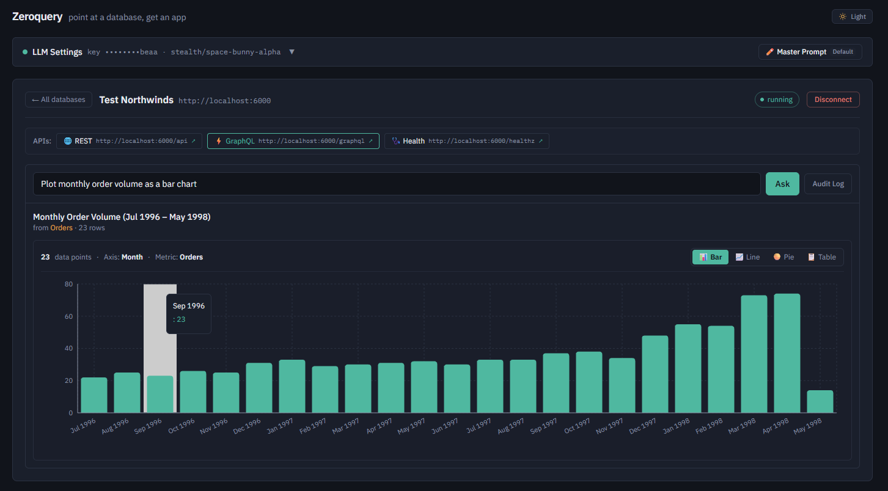
</p>

</div>

---

> [!NOTE]
> **Enterprise-Ready OSS Pattern:** Zeroquery explores the *"connect any database → get an isolated, tool-calling AI application"* pattern. It combines Microsoft Data API Builder (DAB) as an isolated SQL MCP subprocess with .NET 10 orchestration, WinUI 3 native desktop integration, and Next.js dynamic rendering. See [`doc/Plan.md`](doc/Plan.md) for architectural notes and known trade-offs.

---

## 💡 What is Zeroquery?

Connecting AI models to relational databases typically involves either risky direct SQL generation (susceptible to SQL injection and hallucinations) or building bespoke APIs by hand.

**Zeroquery automates this entire lifecycle in seconds:**
1. **Introspects** your database schema (SQL Server, LocalDB, PostgreSQL, MySQL) without reading raw data.
2. Lets you **pick tables, columns, and write operations**, auto-generating natural-language entity descriptions.
3. Compiles a schema-validated `dab-config.json` and spins up an isolated **Microsoft Data API Builder (DAB)** SQL MCP server on an allocated port.
4. Orchestrates an **LLM tool-calling loop** over the Model Context Protocol (MCP) and streams live reasoning.
5. Renders query results into a **dynamically typed UI** (Interactive Tables, Recharts Bar/Line/Pie Graphs, Entity Inspection Cards, Metric Stats, and Human-Confirmed Mutation Forms).

---

## ✨ Key Features

- **🖥️ Native WinUI 3 Desktop App**: A Windows 11 desktop experience featuring translucent Mica backdrops, native startup splash loading rings, and zero open HTTP ports.
- **⚡ In-Process IPC Bridge**: Frontend and .NET backend communicate directly in-memory via WebView2 message dispatching (`chrome.webview.postMessage` ↔ `DesktopIpcDispatcher`) with zero network attack surface.
- **⚡ Zero-Code MCP Provisioning**: Turns any raw connection string into a running, isolated Model Context Protocol (MCP) server in seconds—no manual JSON authoring or CLI commands required.
- **💬 Natural Language to Dynamic UI**: Translates conversational questions into real database queries via DAB's `read_records` and `describe_entities` tools, streaming execution progress live.
- **⏳ Real-Time Loading & Shimmer Indicators**: Never leaves the user with an empty screen—includes native hardware-accelerated WinUI 3 startup splash rings, live query elapsed timers, and animated CSS shimmer skeletons.
- **📊 Adaptive UI Spec Components**:
  - **Tables**: Sortable, typed data grid with source entity attribution.
  - **Charts**: Interactive **Recharts** visualizations (Bar, Line, and Pie) styled with curated theme design tokens.
  - **Cards**: Two-column key/value inspector grids for individual record details.
  - **Stats**: High-impact numeric metric badges for counts, sums, and KPI aggregates.
  - **Forms**: Visual field-level diff preview with editable proposals for database writes.
- **🛡️ Human-in-the-Loop Write Access (Full CRUD)**: Per-entity, per-operation write permissions (`Create`, `Update`, `Delete`). Direct mutation tools are excluded from the LLM's autonomous pool; all writes require explicit human confirmation.
- **🔐 Hardened Security Out-of-the-Box**:
  - **Data Protection API**: Connection strings and OpenRouter API keys are encrypted at rest with AES-256 (`zqenc:v1:`).
  - **SSRF Defense**: Configurable validator blocking loopback, RFC1918 private subnets, and cloud metadata targets (`169.254.169.254`).
  - **OS Resource Limits**: Child processes are bound to Win32 Job Objects with memory caps, CPU quotas, and OS-level `KILL_ON_CLOSE` cleanup.
  - **Rate Limiting**: Tiered IP rate limiting on queries, introspection, instance spawns, and mutations.
  - **Tamper-Evident Audit Trail**: Every write attempt is recorded to an audit log with timestamp, client IP, target entity, operation, and previous vs. proposed values.
- **💾 Encrypted Persistence & Reconnect**: Save connection profiles across restarts with one-click reconnecting and visual progress indicators.
- **🐳 1-Command Docker Stack**: Production-ready multi-stage containers for backend (.NET 10 with pre-installed DAB CLI) and frontend (Next.js).

---

## 🖥️ Desktop Application (In-Process IPC)

Zeroquery is built as a hybrid desktop application targeting **Windows 11** with WinUI 3:

```
┌────────────────────────────────────────────────────────┐
│  ⚡ ZeroQuery Desktop (WinUI 3 + Mica Window)          │
│                                                        │
│  ┌──────────────────────────────────────────────────┐  │
│  │ WebView2 Embedded Client (https://zeroquery.local)│  │
│  │ (Next.js 16 Static Export + React 19 UI)         │  │
│  └────────────────────────┬─────────────────────────┘  │
│                           │ postMessage (JSON)         │
│                           ▼                            │
│  ┌──────────────────────────────────────────────────┐  │
│  │ DesktopIpcDispatcher (C# / .NET 10 In-Process)   │  │
│  │  • Schema Introspection   • Orchestration Loop   │  │
│  │  • Data Protection API    • DAB Process Manager  │  │
│  └──────────────────────────────────────────────────┘  │
│                           │ Direct Process Control     │
│                           ▼                            │
│  ┌──────────────────────────────────────────────────┐  │
│  │ Sandboxed DAB Child Process (Win32 Job Object)   │  │
│  └──────────────────────────────────────────────────┘  │
└────────────────────────────────────────────────────────┘
```

### Why In-Process IPC?
1. **Zero Open HTTP Ports**: Unlike traditional desktop wrappers that spin up an HTTP server on `localhost:5000` (exposing local services to rogue browser tabs and local malware), Zeroquery Desktop communicates entirely in-process using WebView2 IPC.
2. **Virtual Host Mapping**: Web assets are loaded from an isolated virtual domain (`https://zeroquery.local/`) mapped to internal application folders via `SetVirtualHostNameToFolderMapping`.
3. **Hardware-Accelerated Startup**: Frame-0 native WinUI 3 `LoadingOverlay` with Mica backdrop and active `ProgressRing` provides instantaneous feedback while WebView2 initializes, automatically dismissing once the web app signals `app:ready`.

---

## 📐 Architecture

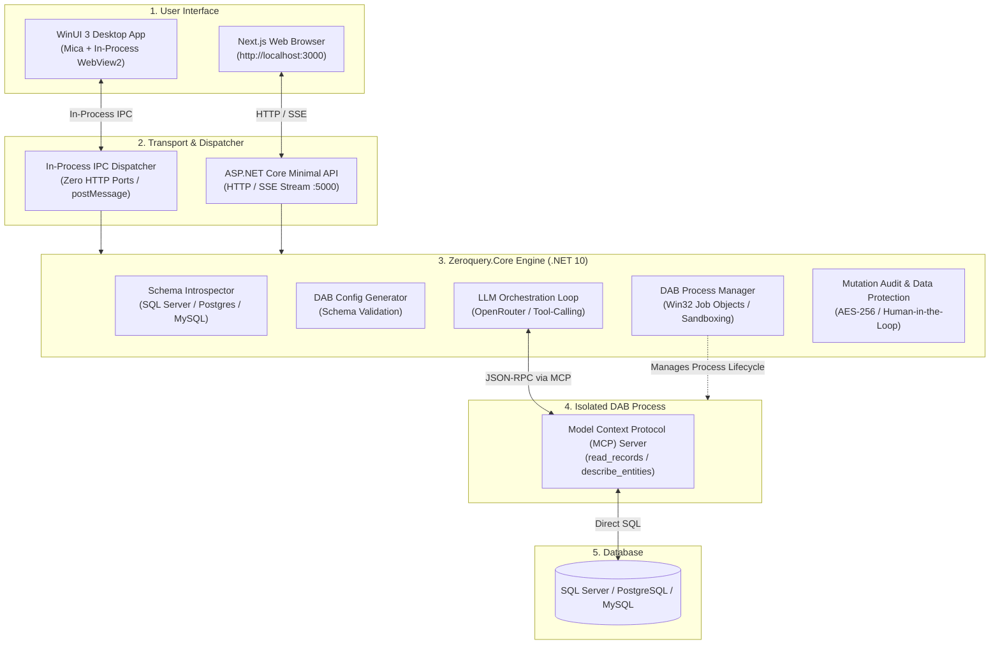

---

## 📸 Visual Walkthrough

Zeroquery guides users from a raw database connection string to a running AI application in under 60 seconds:

### Step 1: Connect Any Database & Introspect Schema
Paste your connection string (SQL Server, LocalDB, PostgreSQL, MySQL). Zeroquery connects securely, tests connectivity, and introspects table schemas without reading raw data. Saved connection profiles can be reconnected with one click.

<p align="center">
  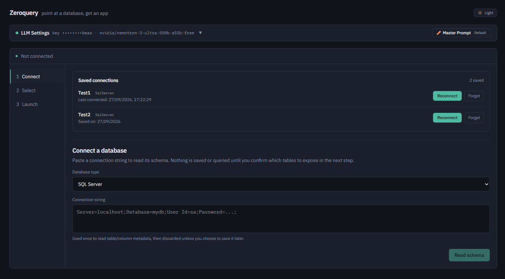
</p>

### Step 2: Choose Entities & Configure Permissions
Pick which tables and views the AI is allowed to query. Opt-in to granular write operations (`Create`, `Update`, `Delete`) per entity, and add natural language descriptions to guide the LLM's query planner.

<p align="center">
  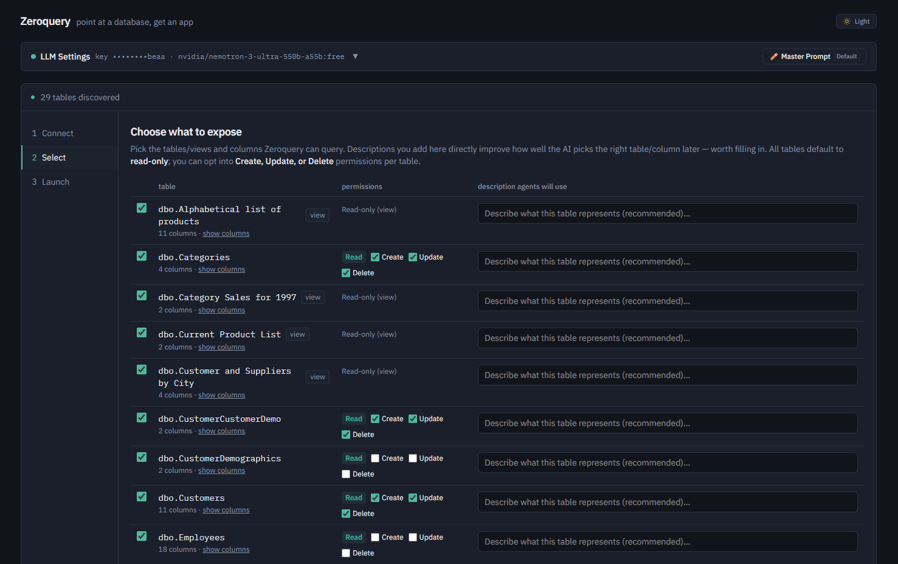
</p>

### Step 3: Configure DAB Runtime & Endpoints
Configure connection string environment variable bindings (`ZQ_DB_CONN`) and optionally enable REST (`/api`) and GraphQL (`/graphql`) endpoints alongside SQL MCP.

<p align="center">
  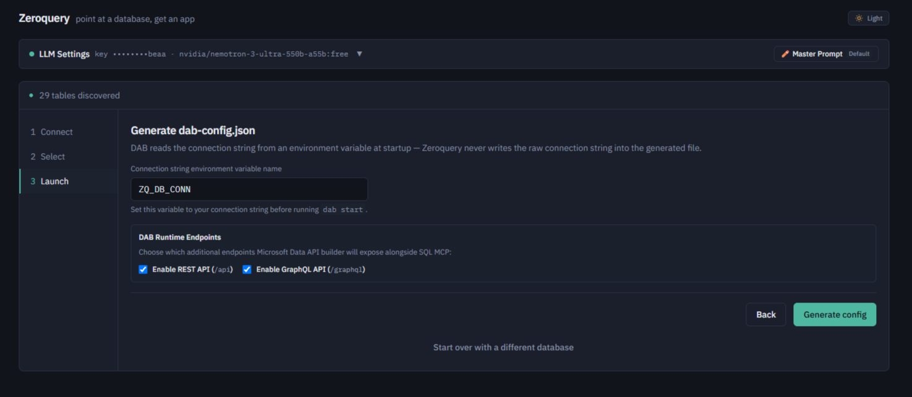
</p>

### Step 4: Validate & Save Connection Profile
Preview the compiled, schema-validated `dab-config.json`. Copy or download the config, save your connection profile for future visits, and click **Start DAB instance** to spawn an isolated child process managed by Zeroquery.

<p align="center">
  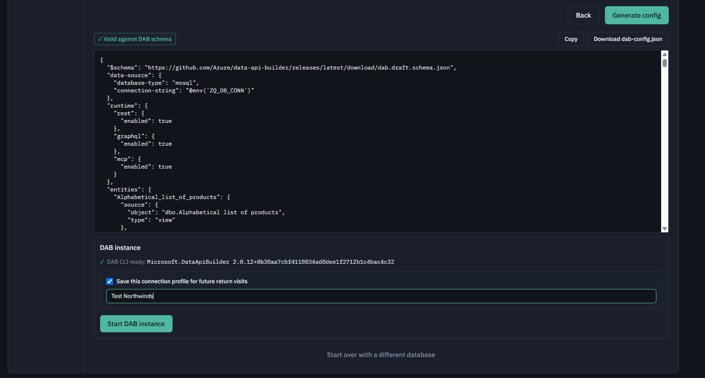
</p>

### Step 5: Live DAB Gateway & Natural Language Querying
The instance launches on an isolated port with live endpoint browsing (`/api`, `/graphql`, `/healthz`). You can immediately start asking conversational questions in natural language.

<p align="center">
  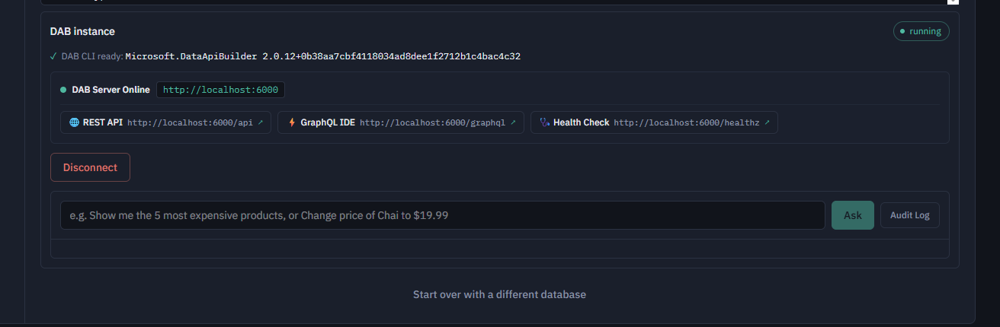
</p>

---

## 📊 Dynamic UI Specs in Action

Zeroquery does not rely on fragile LLM-authored HTML or unstructured markdown tables. The orchestrator instructs the model to call a synthetic tool: **`render_result`** with a typed **`UiSpec`** payload:

| UI Spec Type | Trigger Pattern | Rendered Interface |
| :--- | :--- | :--- |
| **`Chart`** | *"Plot monthly order volume as a bar chart"* | Dynamic **Recharts** visualization (Bar, Line, or Pie) with interactive view switchers (`[Bar] [Line] [Pie] [Table]`), date bucketing, and tooltips. |
| **`Table`** | *"List all active Employees"* | Responsive tabular data grid with column headers, formatted cells, and entity metadata. |
| **`Stat`** | *"What was our total revenue in 1997?"* | Big numeric metric callout card with primary stat value and descriptive label. |
| **`Card`** | *"Show details for Customer ALFKI"* | Two-column attribute key-value inspector for single-record examination. |
| **`Form`** | *"Update unit price of Chai from $18 to $21"* | Interactive diff view showing previous vs proposed values with an explicit confirmation checkbox. |

### 📈 Interactive Charts (Bar, Line, Pie & Table Views)
Ask for volume, trends, distributions, or categorical breakdowns. Zeroquery automatically classifies categories and numeric series, formats date buckets (e.g. `Jul 1996 - May 1998`), and provides interactive view toggles:

**Bar Chart View ("Plot monthly order volume as a bar chart"):**
<p align="center">
  
</p>

**Pie Chart View ("Plot Revenue by category as a Piechart"):**
<p align="center">
  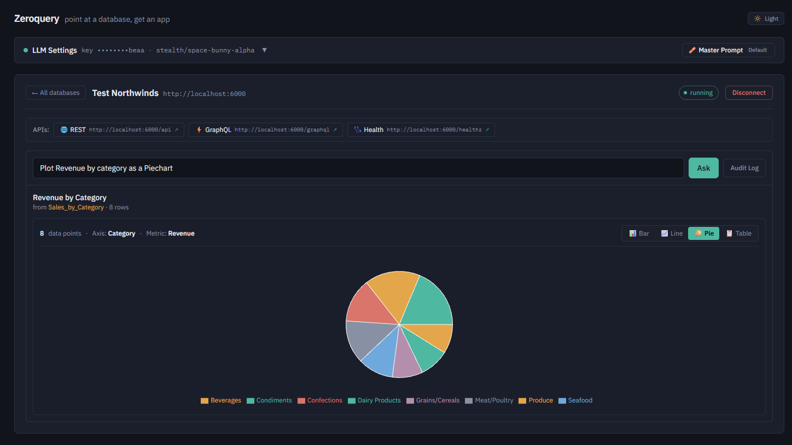
</p>

---

### 📋 Tabular Data Grids
Multi-row datasets formatted with column headers, monospace values, and entity provenance:

**Table View ("List all active Employees"):**
<p align="center">
  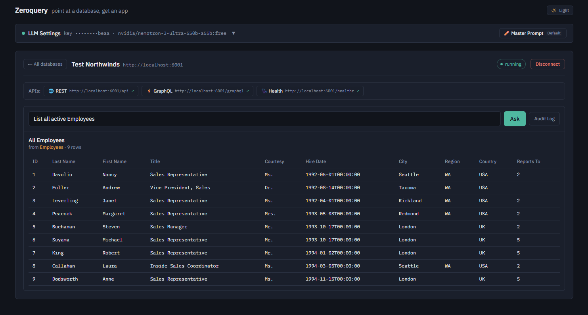
</p>

---

### 🔍 Single-Record Inspection
Detailed attribute inspection for specific entity records and customer details:

**Record Details View ("Show details for Customer ALFKI"):**
<p align="center">
  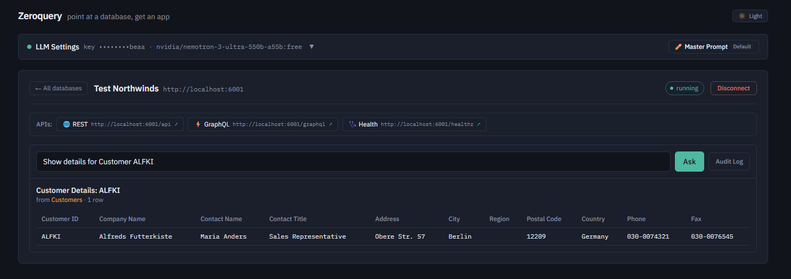
</p>

---

### 💡 High-Impact Stat / KPI Cards
Large numeric badges for executive totals, counts, and financial figures:

**Stat Card ("What was our total revenue in 1997?"):**
<p align="center">
  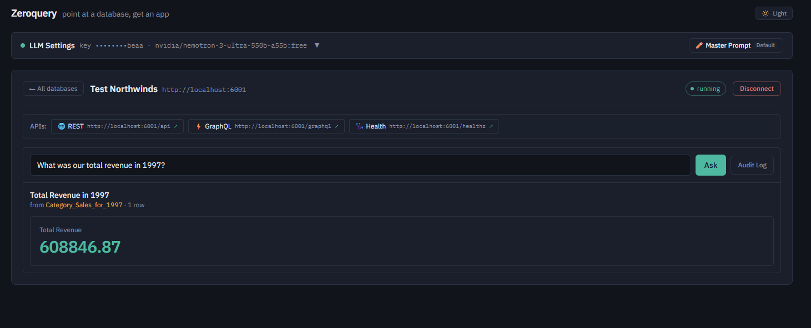
</p>

---

### 🛡️ Human-in-the-Loop Mutation Forms
Zeroquery enforces strict safety boundaries: autonomous database writes are completely disabled. When a modification is requested, Zeroquery generates an interactive diff proposal. The user can review the proposed changes, edit values directly in the UI, and must explicitly check the confirmation box before any database mutation is sent:

**Mutation Confirmation Form ("Update unit price of Chai from $18 to $21"):**
<p align="center">
  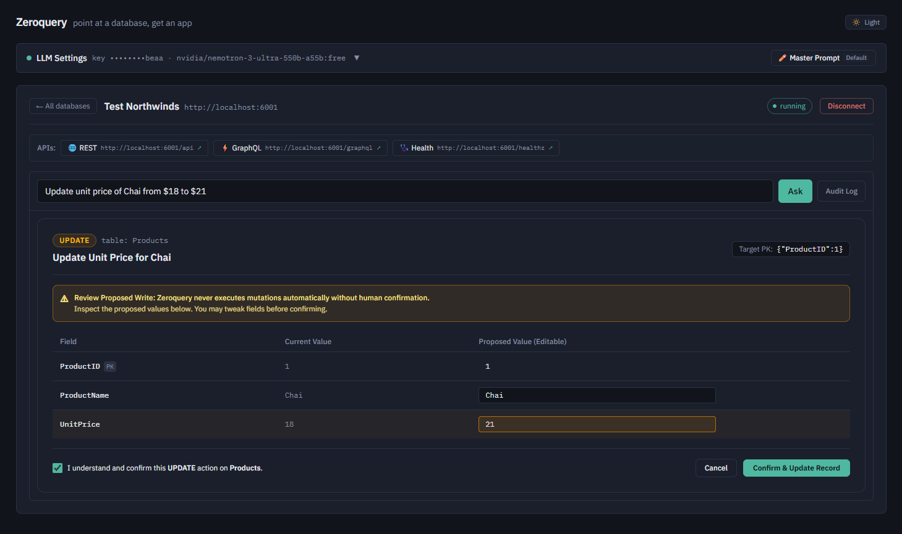
</p>

---

## 🚀 Quickstart Guide

Zeroquery offers multiple deployment options: run as a native Windows 11 desktop app (100% in-process IPC with zero open HTTP ports), launch with Docker Compose, or develop locally.

### Option 1: Native Windows 11 Desktop App (Recommended)

The desktop edition runs fully in-process—no web servers, no open localhost ports, with native Mica translucent styling:

```powershell
# 1. Clone the repository
git clone https://github.com/avikeid2007/ZeroQuery.git
cd ZeroQuery

# 2. Build and export Next.js static client into desktop wwwroot
cd frontend
npm install
npm run build:desktop
cd ..

# 3. Launch the WinUI 3 Desktop Application (Packaged Mode by Default)
dotnet run --project Desktop/ZeroQuery.Desktop -p:Platform=x64

# (Optional: Run unpackaged dev mode without MSIX registration)
# dotnet run --project Desktop/ZeroQuery.Desktop -p:Platform=x64 -p:WindowsPackageType=None
```

#### 🏪 Microsoft Store & MSIX Package Deployment

ZeroQuery Desktop is **packaged by default** as a modern Windows MSIX package compliant with Microsoft Store Partner Center ingestion rules:

* **Build Store-Ready MSIX Package**:
  ```powershell
  dotnet publish Desktop/ZeroQuery.Desktop/ZeroQuery.Desktop.csproj -p:Platform=x64 -c Release
  ```
  Generates `ZeroQuery.Desktop_1.0.0.0_x64.msix` inside `Desktop/ZeroQuery.Desktop/AppPackages/ZeroQuery.Desktop_1.0.0.0_x64_Test/`.

* **Submitting to the Microsoft Store**:
  1. Reserve your app name in the [Microsoft Partner Center Dashboard](https://partner.microsoft.com/dashboard).
  2. Associate the project: In Visual Studio, right-click `ZeroQuery.Desktop` > **Publish** > **Associate App with the Store...** (or update the `<Identity Name="..." Publisher="..." />` in `Desktop/ZeroQuery.Desktop/Package.appxmanifest` with your Partner Center Publisher details).
  3. Run the release publish command above.
  4. In Partner Center, go to **Packages** and upload the generated `.msix` file. Microsoft Store will sign it with the Microsoft Store certificate and distribute it to all Windows 10/11 devices.

* **Option B: Automated GitHub Actions CI/CD**:
  Push a version tag (e.g. `git tag v1.0.0 && git push origin v1.0.0`) or go to **Actions** > **Build & Package for Microsoft Store** > **Run workflow**. The workflow automatically compiles the Next.js frontend, builds the Store `.msix` and `.msixupload` packages, and uploads them to the GitHub release and run artifacts.

* **Option C: Portable Standalone Executable (Unpackaged Folder / Zip)**:
  ```powershell
  dotnet publish Desktop/ZeroQuery.Desktop/ZeroQuery.Desktop.csproj -p:Platform=x64 -c Release -p:WindowsPackageType=None
  ```
  Generates a self-contained folder in `Desktop/ZeroQuery.Desktop/bin/Release/.../publish/` with `ZeroQuery.Desktop.exe` and bundled dependencies that can be zipped and run directly on any Windows 10/11 x64 machine.

> [!TIP]
> ZeroQuery Desktop automatically provisions Microsoft Data API Builder in a sandboxed Win32 Job Object and maps web assets to `https://zeroquery.local/`.

---

### Option 2: 1-Command Docker Stack

The fastest way to deploy the web-based multi-container stack:

```bash
# 1. Clone repository
git clone https://github.com/avikeid2007/ZeroQuery.git
cd ZeroQuery

# 2. Copy the environment template (optional)
cp .env.example .env

# 3. Launch the stack
docker compose up -d
```

- **Frontend App**: [http://localhost:3000](http://localhost:3000)
- **Backend API & DAB Host**: [http://localhost:5000](http://localhost:5000)
- **Persisted Encrypted Data**: Automatically stored in the `zeroquery_data` Docker volume.

To stop the stack:
```bash
docker compose down
```

---

### Option 3: Local Development (Web + API)

For developing the ASP.NET Core backend and Next.js frontend independently:

#### Prerequisites
- [.NET 10 SDK](https://dotnet.microsoft.com/download/dotnet/10.0)
- [Node.js 20+](https://nodejs.org/) and `npm`
- [Microsoft Data API Builder (DAB) CLI](https://learn.microsoft.com/azure/data-api-builder/):
  ```bash
  dotnet tool install -g Microsoft.DataApiBuilder
  ```

#### 1. Run the Backend API
```powershell
dotnet run --project backend/Zeroquery.Api
```
The backend API initializes on `http://localhost:5000`.

#### 2. Run the Next.js Frontend
```powershell
cd frontend
npm install
npm run dev
```
Open [http://localhost:3000](http://localhost:3000) in your browser.

---

## 🤖 Recommended LLM Models

Zeroquery works with any tool-calling model on [OpenRouter](https://openrouter.ai/). You can set your key via the in-app **LLM Settings** panel or through environment variables:

| Model ID | Provider | Best For | Description |
| :--- | :--- | :--- | :--- |
| `openrouter/auto:exacto` | OpenRouter | **Production Default** | Automatically routes to the highest-scoring model for exact JSON schema tool calling. |
| `nvidia/nemotron-3-ultra-550b-a55b:free` | NVIDIA | **Free Evaluation** | Exceptional tool-calling precision without incurring API token costs. |
| `anthropic/claude-3.5-sonnet` | Anthropic | **Complex Analytics** | Best-in-class multi-step reasoning, schema relationship navigation, and aggregation. |
| `openai/gpt-4o-mini` | OpenAI | **Speed & Economy** | Ultra-fast response times and minimal token costs for day-to-day queries. |

---

## ⚙️ Configuration Reference

All settings can be configured via environment variables or `appsettings.json`:

### LLM & Orchestration Settings

| Environment Variable | Default | Description |
| :--- | :--- | :--- |
| `OPENROUTER_API_KEY` | *(empty)* | API key for the LLM provider (can also be saved via the in-app UI). |
| `LLM_MODEL_ID` | `openrouter/auto` | The target model identifier. |
| `OpenRouter__BaseUrl` | `https://openrouter.ai/api/v1` | Chat-completions base URL. Override (via env var or the in-app Settings UI) to use any OpenAI-compatible provider instead of OpenRouter — e.g. OpenAI, Groq, Together AI, DeepSeek, or a local Ollama/LM Studio server. |
| `Orchestration__MaxToolCallIterations` | `10` | Maximum autonomous tool-calling iterations per user prompt. |

### Persistence & Storage

| Environment Variable | Default | Description |
| :--- | :--- | :--- |
| `MCP_PERSISTENCE_MODE` | `save` | Persistence mode: `save` (persist encrypted profiles) or `session-only`. |
| `MCP_PERSISTENCE_DIR` | `%LOCALAPPDATA%/Zeroquery/data` | On-disk directory for encrypted profiles and audit logs. |

### Security & Subprocess Management

| Environment Variable | Default | Description |
| :--- | :--- | :--- |
| `MCP_BLOCK_PRIVATE_NETWORKS` | `false` | When `true`, blocks connections to RFC1918 private IPs, loopback, and cloud metadata. Set `true` for public/multi-tenant deployments. |
| `MCP_MAX_CONCURRENT_INSTANCES` | `10` | Maximum number of simultaneous running DAB subprocesses. |
| `MCP_IDLE_TIMEOUT_MINUTES` | `30` | Idle duration before an inactive DAB subprocess is reaped. |
| `MCP_INSTANCE_MAX_MEMORY_MB` | `512` | Memory cap per DAB subprocess via OS Job Objects (0 = uncapped). |
| `MCP_INSTANCE_CPU_LIMIT_PERCENT` | `50` | Maximum CPU rate quota per DAB subprocess (0 = uncapped). |
| `MCP_SUBPROCESS_USER` | *(empty)* | Optional low-privilege OS user under which child DAB processes execute. |

### Rate Limiting Policies

| Environment Variable | Default | Description |
| :--- | :--- | :--- |
| `RATE_LIMIT_QUERIES_PER_MINUTE` | `30` | Max natural language queries per minute per client IP. |
| `RATE_LIMIT_INTROSPECT_PER_MINUTE` | `10` | Max schema introspection requests per minute per client IP. |
| `RATE_LIMIT_INSTANCES_PER_MINUTE` | `5` | Max database instance launches per minute per client IP. |
| `RATE_LIMIT_MUTATIONS_PER_MINUTE` | `5` | Max database write executions per minute per client IP. |

---

## 🔐 Security Architecture

- **SSRF Defense (`ISsrfValidator`)**: Validates connection hostnames against DNS resolution to prevent attacks on internal cloud metadata (`169.254.169.254`), loopback, or private internal networks.
- **AES-256 Encryption at Rest (`IConnectionStringProtector`)**: Uses ASP.NET Core Data Protection API. Connection strings and API keys are stored encrypted (`zqenc:v1:...`) and only decrypted in-memory when launching child processes.
- **Operating-System Process Isolation**: On Windows hosts, DAB subprocesses are bound to native Win32 Job Objects with `JOB_OBJECT_LIMIT_KILL_ON_JOB_CLOSE`, ensuring guaranteed process termination if Zeroquery exits.
- **Write Exclusion & Audit Trail**: Autonomous write tools are stripped from the LLM. All mutations are confirmed by humans and recorded in `audit-log.json` for compliance review.

---

## 🧪 Testing

The repository includes a comprehensive xUnit test suite covering schema introspection, config generation, SSRF validation, encryption, process lifecycle, rate limiting, and live MCP tool orchestration:

```powershell
dotnet test backend/Zeroquery.Tests
```

```
Passed! - Failed: 0, Passed: 137, Skipped: 0, Total: 137
```

---

## 📁 Repository Layout

```
ZeroQuery/
├── Desktop/
│   └── ZeroQuery.Desktop/      # WinUI 3 Native Windows 11 App (.NET 10)
│       ├── Bridge/             # DesktopIpcDispatcher (In-Process WebView2 IPC)
│       ├── Services/           # DesktopServiceContainer (DI composition root)
│       ├── MainWindow.xaml     # Mica window, LoadingOverlay splash, WebView2 host
│       └── wwwroot/            # Bundled Next.js static export (zeroquery.local)
├── backend/
│   ├── Zeroquery.Api/          # ASP.NET Core Minimal APIs (.NET 10 Web Host)
│   │   ├── Introspection/      # POST /api/introspect
│   │   ├── ConfigGeneration/   # POST /api/config/generate
│   │   ├── Instances/          # POST /api/instances, status & teardown
│   │   ├── Query/              # POST /api/instances/{id}/query & /stream (SSE)
│   │   └── Security/           # Rate limiting & audit endpoints
│   ├── Zeroquery.Core/         # Shared business logic & domain engine
│   │   ├── Introspection/      # SQL Server, PostgreSQL, MySQL schema providers
│   │   ├── ConfigGeneration/   # DAB configuration builder & validator
│   │   ├── Process/            # DabProcessManager, port pool, Win32 Job Objects
│   │   ├── Security/           # SSRF validator, Data Protection encryption
│   │   ├── Mcp/                # Streamable-HTTP MCP JSON-RPC client
│   │   └── Orchestration/      # Tool-calling loop, OpenRouter LLM, UiSpec model
│   └── Zeroquery.Tests/        # 137 Unit & Integration tests
├── frontend/
│   ├── src/app/                # Next.js App Router root layout & page
│   ├── src/components/         # DynamicRenderer, TablePicker, FormView, Recharts, ZeroQueryLogo
│   └── src/lib/                # API client, desktopBridge (WebView2 IPC), types
├── docker-compose.yml          # Single-command stack orchestration
├── CONTRIBUTING.md             # Developer guidelines, architecture rules, PR flow
└── LICENSE                     # MIT License
```

---

## 🤝 Contributing

Contributions, bug reports, and suggestions are welcome! Please read [CONTRIBUTING.md](CONTRIBUTING.md) for details on code style, branch strategies, and pull request procedures.

---

## 📄 License

Zeroquery is open-sourced under the [MIT License](LICENSE) — matching Microsoft Data API Builder's permissive licensing.

See [PRIVACY.md](PRIVACY.md) for the project's privacy policy.
