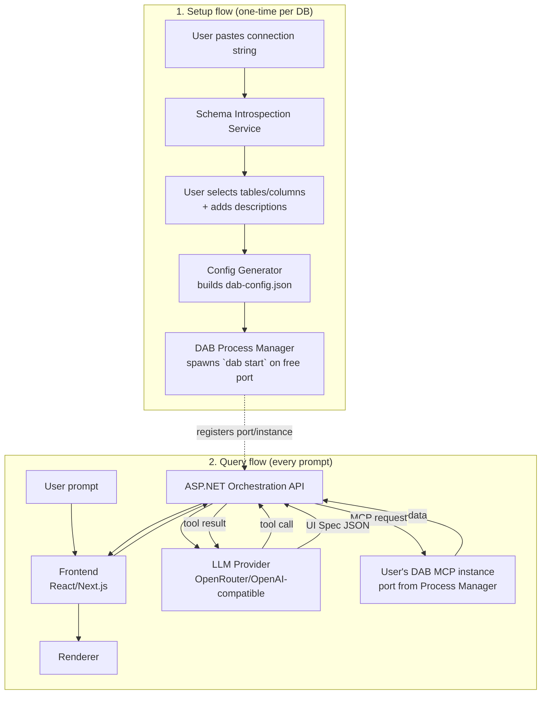

# Zeroquery: Open Source Generative Database App — Plan

**Project name:** Zeroquery

**Status: experimental.** This is being built to learn and explore the pattern, not shipped or claimed as production-ready. See Section 9 for known limitations.

**Goal:** An open-source, self-service web app where a user pastes a connection string, picks the tables/columns/descriptions they want exposed, the app auto-generates a DAB config and spins up a DAB SQL MCP server for it — then lets users query that database in natural language and get back a dynamically rendered UI (table, chart, card).

This turns "point at any database → get an AI-queryable app" into a community tool, not a one-org deployment.

---

## 1. Architecture Overview



**Five layers now, not four** — the new piece is the **DAB Provisioning Service**, which turns a raw connection string into a running, scoped MCP server without the user touching JSON or a CLI.

---

## 2. Component Details

### 2.1 Schema Introspection Service (new)

- Takes a connection string, runs a lightweight metadata query (`INFORMATION_SCHEMA` for SQL Server/MySQL/Postgres, or provider-specific equivalent) — **never** a full data read at this stage
- Returns tables, columns, types, and detected relationships (FKs) for the picker UI
- Runs this as a short-lived, isolated check — don't persist the connection string until the user confirms setup

### 2.2 Table/Column Picker UI (new)

- User selects which tables/views to expose, which columns, and writes a short natural-language description per entity/column (this description directly improves the LLM's tool-selection accuracy later — worth making it a first-class, encouraged field, not optional)
- Also where the user sets basic permissions (read-only vs. per-operation create/update/delete per entity) — default to **read-only**, with write ops opted into individually; full CRUD is a planned Phase 8 deliverable, not just a stretch goal

### 2.3 Config Generator (new)

- Converts the picker output into a valid `dab-config.json`:
  - `data-source` block (connection string reference, not inline — see security section)
  - one `entities` block per selected table, with the user's descriptions attached as entity metadata (DAB supports this — it's what the MCP tool descriptions are built from)
  - `runtime.mcp.enabled = true`
- Validates the generated config against DAB's schema before attempting to start a process (fail fast with a clear error instead of a crashed subprocess)

### 2.4 DAB Process Manager (new — the core new piece)

- Spawns `dab start --config <path>` as a subprocess per active database, on a dynamically allocated free port
- Maintains a registry: `{ userId/dbId → { processId, port, startedAt, lastUsedAt } }`
- **Lifecycle management is the hard part here:**
  - Idle timeout: kill subprocesses unused for N minutes, free the port/resources (critical for a community tool with potentially many one-off connections)
  - Health checks: periodic ping to `/mcp` on each running instance; restart or evict on failure
  - Startup queue: cap concurrent DAB subprocesses (config value), queue or reject new starts beyond that cap
  - Graceful shutdown: on app restart/deploy, terminate all child DAB processes cleanly
- The orchestration API talks to a given user's instance via its registered port — never hardcoded, always looked up from the registry per request
- **Status states, exposed via `GET /api/instances/{id}/status`** so the frontend can show a live indicator instead of a silent black box:
  - `provisioning` — config validated, subprocess spawn requested, port not yet confirmed
  - `starting` — process running, waiting on first successful health check
  - `running` — healthy, actively serving MCP requests
  - `idle` — healthy but no requests within the idle window; counting down to reap (see `MCP_IDLE_TIMEOUT_MINUTES`)
  - `stopped` — reaped (idle timeout) or manually disconnected by the user
  - `error` — process exited unexpectedly or failed health checks; include last stderr line for the user to see
  - Frontend polls this endpoint (or subscribes via SSE, reusing the same stream used for query results) and renders a small status badge next to the DB name — this is the visible proof that "connect" actually did something, which matters a lot for trust in a tool that's spawning processes behind the scenes

### 2.5 Frontend (React/Next.js)

- Two modes: **Setup wizard** (connection string → picker → confirm) and **Query view** (prompt → UI Spec)
- Same rendering approach as before: fixed component library, no arbitrary code execution

### 2.6 ASP.NET Orchestration API

- Same tool-calling loop as before, but now MCP target is resolved per-request from the Process Manager's registry instead of a single fixed production endpoint
- Same UI Spec validation boundary

### 2.7 LLM Provider Layer

- Unchanged from before — OpenRouter/OpenAI-compatible via `ILlmProvider` abstraction

---

## 3. Security — Critical for an Open-Source Community Tool

This is the section to over-invest in, since (unlike your org's internal MCP) this now accepts **arbitrary connection strings from unknown users**:

- **Connection string handling**: encrypt at rest (e.g., ASP.NET Data Protection API or a secrets manager), never log them, never echo them back to the frontend after initial entry
- **Network egress**: the host running DAB subprocesses needs to be able to reach arbitrary user databases — this means outbound network access is wide by necessity. Mitigate with:
  - Per-instance resource limits (CPU/memory caps on subprocesses, even without full containers)
  - Rate-limiting query volume per instance
  - Blocking connections to internal/private IP ranges (prevent SSRF-style abuse where someone points "their DB connection string" at your own internal infrastructure)
- **Default to read-only** entities unless the user explicitly opts a table into write access
- **Process isolation**: subprocesses share the host OS — run them under a dedicated low-privilege OS account, not the same identity as your orchestration API
- **Abuse/cost controls**: since this is community-facing, cap concurrent DAB instances and LLM calls per user/IP to avoid one bad actor exhausting resources or running up your OpenRouter bill
- **Revised recommendation given "subprocess, not container"**: this is fine to start and ship faster, but flag it in the README as a v1 tradeoff — containerizing per-instance (even lightweight, e.g. Firecracker/gVisor-style) is the natural v2 hardening step once the community tool gets real traffic, since subprocess isolation alone is weaker than container isolation for untrusted multi-tenant workloads.

---

## 4. Configurable Operational Settings

Three settings are now confirmed as **deployment-configurable** (env vars / config file, not hardcoded), since this is OSS and different self-hosters will have different risk tolerance and hardware:

| Setting | Config key (suggested) | Default (suggested) |
| --- | --- | --- |
| Config persistence mode | `MCP_PERSISTENCE_MODE` = `save` \| `session-only` | `save`, with explicit "Reconnect to \[DB\]?" confirmation on return (never silent auto-reconnect) |
| Max concurrent DAB subprocesses per host | `MCP_MAX_CONCURRENT_INSTANCES` | `10` for a small self-hosted instance; documented as "tune to your host's RAM/CPU" |
| Idle timeout before reaping a subprocess | `MCP_IDLE_TIMEOUT_MINUTES` | `30` |

Document all three prominently in the OSS README/`.env.example` — self-hosters running this on a small VPS vs. a beefy server need very different values, and sensible-but-visible defaults are better than either hardcoding or leaving them undocumented.

---

## 5. UI Spec Contract (draft schema — unchanged)

```json
{
  "type": "table | chart | card | stat | form",
  "title": "string",
  "columns": [{ "key": "string", "label": "string" }],
  "rows": [ { } ],
  "chartType": "bar | line | pie",
  "meta": { "sourceEntity": "string", "generatedAt": "ISO8601" }
}
```

---

## 6. Build Phases

| Phase | Scope | Outcome | Status |
| --- | --- | --- | --- |
| **0. Contract design** | UI Spec schema + DAB config schema validation rules | Shared contracts for all downstream work | ✅ Done |
| **1. Introspection + Picker** | Connection string → schema read → table/column/description picker UI | User can select what to expose, nothing runs yet | ✅ Done |
| **2. Config Generator** | Picker output → valid `dab-config.json` | Config file produced and schema-validated | ✅ Done |
| **3. Process Manager** | Subprocess spawn/kill, port registry, idle timeout, health checks | A DAB MCP instance can be started, queried, and reaped on demand | ✅ Done |
| **4. Orchestration skeleton** | ASP.NET API, `ILlmProvider`, OpenRouter integration against a running instance | Prompt → real data → UI Spec, single-instance | ✅ Done |
| **5. Frontend** | Setup wizard + query view, component renderer, SSE streaming | Full user flow, one DB at a time | ✅ Done |
| **6. Security hardening** | Encryption at rest, egress restrictions, resource caps, rate limits | Safe for public community use | ✅ Done |
| **7. Persistence** | Saved connections, "reconnect" flow, "forget connection" action | Return visits don't require re-setup | ✅ Done |
| **8. Write access (full CRUD)** | Per-entity write permissions in picker UI, confirm-before-execute flow in the `form` UI Spec type, audit trail, write-specific rate limits | Create/update/delete supported, opt-in per table, with a human confirmation step before any write reaches the MCP server | ✅ Done |
| **9. Polish/OSS readiness** | README, docs, error states, deployment guide (Docker Compose for the whole stack) | Ready to publish/share | 🟡 Partial *(next up)* |

### 6.1 Detailed progress checklist

Kept in sync with the actual codebase (see repo memory notes for exact files/tests) —
check here first before assuming a phase is unfinished or re-doing completed work.

**Phase 0 — Contract design** ✅
- [x] UI Spec schema (`type/title/columns/rows/chartType/meta`) — `UiSpec.cs`
- [x] DAB config JSON-schema validation wired against DAB's own published schema

**Phase 1 — Introspection + Picker** ✅
- [x] `POST /api/introspect` (SQL Server / PostgreSQL / MySQL)
- [x] Table/column/description picker UI (`TablePicker.tsx`)

**Phase 2 — Config Generator** ✅
- [x] `POST /api/config/generate` → schema-validated `dab-config.json`
- [x] Connection string kept out of the generated file (`@env('NAME')` only)
- [x] Primary-key fallback fix for keyless views (composite-key-of-all-columns)

**Phase 3 — Process Manager** ✅
- [x] `dab start` subprocess spawn/kill + free-port allocation
- [x] Status states (`Provisioning/Starting/Running/Idle/Stopped/Error`) + `GET /api/instances/{id}/status`
- [x] Idle-timeout reaper + graceful shutdown on app stop
- [x] Concurrency cap (429 when exceeded)

**Phase 4 — Orchestration skeleton** ✅
- [x] `McpClient` (real DAB MCP wire protocol) + `ILlmProvider`/`OpenRouterLlmProvider`
- [x] Tool-calling loop with synthetic `render_result` tool → `UiSpec`
- [x] `POST /api/instances/{id}/query` (blocking variant)
- [x] Runtime-configurable LLM settings (UI panel + env vars), not just static config

**Phase 5 — Frontend** ✅
- [x] Setup wizard (Connect → Select → Launch) matching the approved mock design
- [x] Query view renders Table/Chart/Card/Stat (Recharts for Chart)
- [x] `POST /api/instances/{id}/query/stream` (SSE) + live progress UI
- [x] Backend upgraded to .NET 10 to get native `TypedResults.ServerSentEvents`

**Phase 6 — Security hardening** ✅
- [x] Encrypt connection strings at rest (`IConnectionStringProtector` via ASP.NET Data Protection API)
- [x] Block SSRF-style connections to internal/private IP ranges (`ISsrfValidator` / `SsrfValidator`)
- [x] Per-instance CPU/memory resource caps on `dab` subprocesses (`IProcessResourceLimiter`, Win32 Job Object with kill-on-close)
- [x] Rate-limit queries + concurrent instances per user/IP (ASP.NET Core RateLimiter policies + `MaxInstancesPerIp` cap)
- [x] Run DAB subprocesses under a dedicated low-privilege OS account (`MCP_SUBPROCESS_USER`, `MCP_SUBPROCESS_PASSWORD`, `MCP_SUBPROCESS_DOMAIN`)

**Phase 7 — Persistence** ✅
- [x] Saved connections (survive a backend restart — connection string encrypted at rest via Data Protection API, `dab-config.json` text, and metadata)
- [x] LLM provider settings (OpenRouter API key and model) persisted to disk encrypted across backend restarts
- [x] "Reconnect to [DB]?" explicit confirmation flow (no silent auto-reconnect)
- [x] "Forget this connection" action (deletion from persistent storage)
- [x] Configurable persistence modes (`MCP_PERSISTENCE_MODE`: `save` vs `session-only`; `MCP_PERSISTENCE_DIR`)
- [x] Frontend UI integration: `SavedConnectionsList` on the Connect step, explicit modal confirmation on reconnect, direct transition into active `QueryView`, and "Save this connection profile" toggle in `ConfigPreview`.

**Phase 8 — Write access (full CRUD)** ✅
- [x] Per-entity, per-operation write permissions in the picker UI (`Create`, `Update`, `Delete` opt-ins on base tables with primary keys)
- [x] `form` UI Spec type + confirm-before-execute flow (`UiSpecType.Form`, diff preview, editable proposed values, human confirmation checkbox)
- [x] Autonomous mutation tool exclusion (LLM cannot execute writes directly behind the scenes; mutations require human confirmation)
- [x] Dedicated write audit trail (`IWriteAuditStore` / `FileWriteAuditStore`, `audit-log.json`, `GET /api/audit`, `AuditLogModal.tsx`)
- [x] Write-specific (tighter) rate limits (`mutations` policy, default 5 mutations/min per IP via `RATE_LIMIT_MUTATIONS_PER_MINUTE`)

**Phase 9 — Polish / OSS readiness** 🟡 *(next up)*

---

## 7. Tech Stack Summary

| Layer | Choice |
| --- | --- |
| Frontend | Next.js (React), Recharts, SSE |
| Orchestration | ASP.NET Core (Minimal API), `System.Text.Json` |
| LLM | OpenRouter (OpenAI-compatible), model configurable per env |
| Data layer | Dynamically provisioned DAB SQL MCP subprocesses (v2: containers) |
| Process management | Custom .NET `Process` wrapper + registry (in-memory or Redis if scaling beyond one host) |
| Secrets | ASP.NET Data Protection API (or a secrets manager for larger deployments) |
| Telemetry | Application Insights or OpenTelemetry (OSS-friendly default) |
| Hosting | Single host to start; document scaling path (registry in Redis, multi-host) for later |

---

## 8. Decisions — Resolved

- [x] **Process model**: subprocess (`dab start`), not containers — v1 decision, flagged for v2 hardening
- [x] **Config persistence / max concurrent instances / idle timeout**: all deployment-configurable — see Section 4
- [x] **Write access (`form` type) — full CRUD**: **confirmed for implementation**, not deferred. Read-only ships first (Phases 0–5) as the safe, stable foundation, but Create/Update/Delete is now a planned deliverable — targeted at **Phase 6**, not optional. Given the risk profile (untrusted users, arbitrary databases), CRUD needs its own hardening beyond what read-only requires:
  - **Per-entity, per-operation permissions** in the picker UI — a table can be exposed as read-only, or explicitly opted into create/update/delete individually (not one blanket "write" toggle)
  - **Confirmation step before execution** — the LLM proposes a write (shown as a diff/preview in the UI Spec's `form` type), the user explicitly confirms before it's sent to the MCP server; no write fires directly from a prompt with no human in the loop
  - **Audit trail** — every write (who, what entity, what changed, when) logged separately from general telemetry, queryable later if something goes wrong
  - **Row-level scoping where possible** — prefer exposing writes via narrow, purpose-built entities/views over raw table CRUD, so a "cancel a tee time" action is possible without a general-purpose "delete any row" tool
  - **Rate limiting writes specifically**, tighter than read rate limits
- [x] **License**: **MIT**, matching DAB's own license — keeps the whole stack license-compatible and is the expected default for a dev-tooling OSS project.
- [x] **Default OpenRouter model recommendation**: don't hardcode one model — recommend OpenRouter's **`:exacto`** routing suffix (or `openrouter/auto` with tool-calling preference), which routes to whichever backing provider has the best real-world tool-calling reliability at request time, rather than pinning to one model that may degrade or get deprecated. For the docs' "quick start" default, suggest a capable, moderately-priced tool-calling model (a GPT-4o-class or Claude-class model via OpenRouter) as the out-of-box default, with the model ID exposed as a config value (`LLM_MODEL_ID`) so self-hosters can freely swap to cheaper/local-friendly options. Document 2-3 alternates in the README (a premium option, a budget option) rather than a single fixed recommendation, since OpenRouter's model landscape and pricing shift often enough that a hardcoded "best model" in docs goes stale fast.

## 9. Known Limitations & Risks — Experimental, Not Production-Ready

Zeroquery is being built as an **experiment**, not a claimed production-ready product. Worth stating plainly in the README so expectations are set correctly for anyone trying it:

- **Prompt injection via the database's own data**: confirm-before-execute protects against the LLM inventing a bad write out of nowhere, but not against adversarial text sitting inside the data itself (a `notes` field, user-generated content) steering a later tool call. This is a known, hard-to-fully-close class of risk for any read+write agent — not something v1 can claim to have solved. Confirmation dialogs only help if the user actually reads and understands what they're approving.
- **DAB's ceiling on complex queries**: DAB is well-suited to simple CRUD but weaker on custom business logic, multi-entity joins/aggregations, and complex validation. A natural-language ask that needs a real cross-table aggregation may require the LLM to stitch together multiple tool calls and aggregate client-side — slower and more error-prone than one well-formed SQL query. Some analytical queries may just be out of scope for v1; better to say so than to imply Zeroquery handles arbitrary SQL-equivalent questions.
- **Hosting model still open**: self-hosted (Docker Compose, user's own infra) is the recommended default — it distributes credential/liability risk to each self-hoster rather than centralizing it. A hosted "point us at your DB" service model is a materially different risk profile and is explicitly **not** the v1 plan.
- **Maintainer bandwidth**: this is one of several active projects; "OSS with community adoption" implies ongoing issue/PR/security-report maintenance beyond just shipping v1. Scope and release cadence should stay realistic rather than implied as fully supported.

---

Phase 1 (Introspection + Picker) — it's the new, unproven part of the system and has no dependency on the orchestration/LLM work you've already scoped.